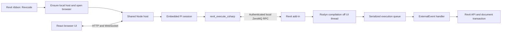

# Revcode implementation plan

Status: architecture baseline researched 2026-09-12. An end-to-end prototype is now implemented; see README.md and docs/TESTING.md for its actual scope and validation. The prototype keeps the required ZeroMQ native bridge, uses one Node host per Revit process, and puts Roslyn compilation in a separate worker. The shared multi-process scheduler and several later-stage features below remain future work.

Build a Windows Revit add-in that opens a browser chat with one ribbon click. A local Node host embeds Pi. The agent primarily interacts with Revit through one C# execution tool. Support Revit 2025 onward, with .NET 8 as the minimum and explicit support for newer host runtimes.

**1. Reference architecture and reuse**

The reference is Hoppercode commit `7dcaf5a1820e5e5d535eaaa35e95abbdad6041c5`, inspected from a fresh clone. Search-indexed GitHub content describes an older implementation; use the pinned source when adapting it.

The current source contains `web/`, `src/host/`, `src/protocol/`, `protocol/v2/`, and `dotnet/`. Its dependencies pin `@earendil-works/pi-coding-agent` and related Pi packages to `0.85.1`. Its native RPC uses ZeroMQ DEALER/ROUTER with a separate event channel. Rhino script execution ultimately delegates to Rhino's scripting infrastructure; that executor is not portable to Revit.

Recommended approach: selectively adapt the existing browser UI, Pi integration, launcher/discovery, and transport contracts. Preserve MIT notices. Replace the native modeling adapter, document binding, and transaction implementation. Do not copy the entire multi-agent scheduler or Grasshopper tool catalog into the MVP. Keep a short upstream provenance record for copied modules and their modifications.



The node host owns model calls, chat history, credentials, event streaming, and operation records. The add-in owns all live Revit objects, document identities, native execution, transactions, and native operation receipts. Pi does not run inside Revit. Neither Node nor the browser loads RevitAPI.dll.

Keep Pi behind a small adapter for session creation, prompt, abort, events, and tool registration. Start with Hoppercode's pinned SDK integration rather than mixing it with older examples using different package names. Disable default shell/file mutation tools and automatic third-party extension discovery. Supply the Revit instructions directly so a filesystem read tool is not required just to discover basic guidance.

**2. One-click lifecycle**

1. A per-user installer places the prebuilt add-in and versioned support files locally and registers a `.addin` manifest for each supported installed Revit year. Initial installation requires a Revit restart.
2. `IExternalApplication.OnStartup` registers the ribbon and lifecycle listeners. Avoid starting Node or loading Roslyn merely because Revit opened.
3. The Revcode ribbon invokes an `IExternalCommand`. In this valid API context, initialize the native service and create its `ExternalEvent`. Capture initial document metadata and return promptly; never wait synchronously for network initialization on Revit's thread.
4. A hidden launcher ensures one compatible host per Windows user. Protect discovery with a lock and atomic writes. Use dynamically selected loopback ports and authenticated readiness checks. Concurrent clicks must converge on one host.
5. Serve the browser shell before Pi finishes initialization. Register the launching Revit process using PID plus start identity and an attachment generation. The UI shows separate host, provider, and Revit readiness states.
6. Open the default browser on an authenticated local URL. Repeated clicks reconnect to the existing host and selected document. Browser reloads restore the conversation; closing a tab does not cancel a running tool.
7. Revit shutdown removes its attachment. Other connected Revit processes remain usable. The host exits after the last attached process exits, with bounded cleanup. A transport disconnect alone does not prove Revit exited.

First use may require provider sign-in or an API key. Subsequent use should require no terminal, global Pi install, package restore, or compilation setup. Bundle Node, built UI/host assets, Roslyn dependencies, and any required reference assets. Keep provider credentials in the host's credential storage, never in browser storage or native logs.

Use `%LOCALAPPDATA%/Revcode/` for versioned runtime files, control records, logs, and history. Give control files user-only Windows ACLs. Bind all listeners to loopback, authenticate both browser and native RPC, validate browser origins/hosts, and remove any bootstrap fragment after exchanging it for a session credential. These are required because this endpoint can execute C# with the user's privileges.

**3. How live C# execution works**

There is no need to rebuild/reload the installed add-in for every snippet. The installed add-in is a stable host. Each snippet becomes a temporary compiled assembly loaded into the running Revit process.

Use Roslyn `CSharpCompilation` with an ordinary method wrapper, rather than starting a persistent C# scripting REPL. This gives explicit references, predictable scope, source diagnostics, and a controlled lifetime without cross-submission globals. Revit SDK macros, Dynamo, and Rhino.Inside are unnecessary dependencies for this design.

Proposed script ABI:

```csharp
public interface IRevcodeScript
{
    object? Execute(RevcodeContext ctx);
}
```

The tool accepts a method body plus optional using directives. The compiler generates the class and method and uses `#line` to map errors and PDB stack locations back to `snippet.cs`. The context supplies `doc`, `uidoc`, `uiapp`, a bounded logger, explicit unit helpers, and `CheckCancellation()`. These objects are usable only during synchronous execution. No async entry point, background Revit calls, persistent script globals, or model objects returned to Node.

Execution pipeline:

1. Validate source size/options and bind the request to an authenticated process, document token, and attachment generation. Persist intent and allocate an operation ID before dispatch.
2. Compile on a background thread using Roslyn. Reference the exact running Revit API assemblies, the shared Revcode scripting contract, and a curated compatible BCL reference set. Capture reference paths/identities during native initialization; background compilation must not query Revit objects.
3. Emit DLL and portable PDB bytes. Return compiler diagnostics immediately on failure. No model transaction exists during compilation.
4. Load the snippet into a collectible `AssemblyLoadContext`. Resolve RevitAPI, RevitAPIUI, and the Revcode contract to their existing host assemblies; never load private duplicates. Bound caches by source hash, API identity, runtime profile, compiler options, and wrapper version.
5. Queue execution and signal `ExternalEvent.Raise()`. Handle Accepted/Pending/Denied results explicitly and ensure queued requests cannot be stranded by coalesced signals. Process bounded work per callback and resignal remaining work through a validated scheduling path.
6. In `IExternalEventHandler.Execute(UIApplication)`, validate the attachment and document again, check relevant state, acquire the operation's transaction if needed, and invoke the script synchronously.
7. Convert its result into bounded JSON while still inside the valid API context. Serialize before commit so an unsupported return value can fail and roll back an edit. Finish the transaction, produce the native receipt, then return only plain data to transport code.
8. Drop script instances/delegates, initiate unloading, and release references. Test collection over repeated executions; unloading is cooperative and can be prevented by retained references.

Use a dedicated compiler dependency load context to avoid contaminating Revit's default context with Roslyn dependencies. The first spike must test coexistence with other installed add-ins. If this proves unreliable, move only compilation into a bundled compiler worker process. That preserves the tool protocol and execution host. A worker can be terminated during compilation; it cannot execute live Revit model operations remotely.

Start with trusted bundled references and no dynamic NuGet restore. Add package support only after dependency identity and unload behavior are understood. Script edits take effect on the next call; changes to the installed native host still require a Revit restart.

**4. The agent-facing tool**

Expose one modeling tool initially:

```typescript
revit_execute_csharp({
  code: string,
  usings?: string[],
  mode: "query" | "modify",
  transactionName?: string
})
```

The host injects document binding and operation identity. The model must not choose arbitrary process IDs, supply credentials, or silently redirect a call to another document. Cancellation, operation status, document discovery, and reconnect are internal protocol operations, not extra modeling tools.

`query` opens no transaction. `modify` opens one host-owned transaction with a clear Undo label. Both run through the same ExternalEvent queue, because reading the Revit API also requires valid context. Block direct transaction management in the supported snippet contract and flag it in semantic validation. A query label is a programming contract, not a security sandbox for arbitrary C#.

Example query body:

```csharp
return new FilteredElementCollector(ctx.Doc)
    .OfClass(typeof(Level))
    .Cast<Level>()
    .Select(level => new {
        id = level.UniqueId,
        name = level.Name,
        elevationMm = UnitUtils.ConvertFromInternalUnits(
            level.Elevation, UnitTypeId.Millimeters)
    })
    .ToArray();
```

Return a structured envelope with `operationId`, phase, outcome, plain JSON result, bounded logs, source diagnostics, warnings/failures, model-change summary, transaction status, and compilation/execution timings. Distinguish compile failure, stale target, queued cancellation, rolled-back execution, committed execution, and outcome unknown. Return created/modified/deleted identities where observable; capture committed change summaries through Revit document events with operation attribution.

Inject a small context snapshot before each prompt: selected process/document, runtime/API version, active view, project/family kind, units, and bounded selection IDs. Let C# queries discover everything else. Return materialized arrays rather than lazy enumerables, page large queries, and use stable element UniqueIds across turns. Include tested examples for querying, parameter changes, element creation, units, and family/project differences. The initial workflow is inspect, modify, then query to verify. Visual capture can be added later if actual tasks demonstrate a need.

**5. Revit execution rules and limits**

Revit's UI thread alone is insufficient: calls need a valid Revit API callback. `Task.Run`, WPF Dispatcher, HTTP handlers, and ZeroMQ handlers cannot directly access the model. ExternalEvent execution may wait while another command, edit mode, or dialog occupies Revit. Show "Waiting for Revit" separately from "Running C#".

Serialize native operations per Revit process, including reads. In the MVP, require the bound document to remain active; report a target change rather than automatically switching documents. Use an in-memory document-open token, not title/path alone: unsaved files, reopened files, Save As, and duplicate filenames must not cause misrouting. Refresh context after human edits; support revision/precondition checks for operations that rely on an earlier query.

Each modify call owns one transaction and one normal Revit Undo item. Catch exceptions and roll back that transaction; verify the actual transaction status before reporting success. Never keep a transaction or transaction group open across model turns or asynchronous callbacks. A multi-call request can therefore partially succeed, and Stop does not undo earlier committed calls. Later, a host-managed TransactionGroup can group multiple transactions within one synchronous call when an API workflow requires it.

Configure failure handling deliberately. Collect warnings; unresolved errors should drive rollback rather than leave unattended dialogs. Treat `Pending` as unresolved, not committed or rolled back. Keep the process unavailable for further native operations until failure processing and cleanup reach a confirmed terminal state. Do not dismiss arbitrary user dialogs or automatically suppress every warning.

Transactions cover supported model edits, not filesystem writes, exports, saves, network activity, or every UI effect. Exclude save/sync/close, cross-document writes, arbitrary process launches, and external side effects from the supported MVP script contract. These can gain explicit host-controlled semantics later.

Cancellation can stop generation, compilation, and queued jobs. Running snippets can check cancellation between operations and roll back their current transaction. Arbitrary C# or a long native API call cannot be forcibly interrupted safely in-process. A loop that never checks cancellation can freeze Revit. Keep snippets short, flag unsafe patterns, and expose a watchdog status without promising a hard execution timeout. Never kill Revit as routine cancellation.

Dynamic C# is full-trust code. Reference filtering, syntax/semantic checks, and collectible contexts improve reliability; they do not provide a security boundary. A strong sandbox would require narrowing the language/API or running against a separate Revit process, which changes the direct live-document design.

**6. Reconnect and uncertain outcomes**

Journal accepted UI commands and native operation intent before dispatch. Repeated request IDs must retrieve the existing operation or retained result rather than execute again. Native receipts should outlive browser/host disconnects while Revit remains alive. Source hashes and binding information must agree on duplicate submissions.

A transport timeout does not mean an edit failed. Mark potentially started work as outcome unknown, block further execution on that process, and query the native operation ledger after reconnection. If Revit crashed in the gap between commit and durable receipt, reconciliation may require inspecting the model; do not replay the write automatically. Do not claim exactly-once edits across crashes.

Browser reconnection resumes events/transcript, not model mutations. Host restart restores records and marks interrupted turns for recovery rather than automatically rerunning the last prompt. Store Pi session history separately from the host operation journal, with clear linked identities.

**7. Version and packaging strategy**

User scope: Revit 2025 onward; .NET 8 and newer. Autodesk's September 2026 documentation states Revit 2026.5 uses .NET 10 and Revit 2027 supports .NET 10. Revit 2025 is also undergoing updates. Do not map every Revit 2025+ installation blindly to net8.0.

Local executable inventory: Revit 2025 `25.4.41.14`, Revit 2026 `26.3.0.37`, Revit 2027 `27.0.10.13`. Installed SDKs include `9.0.312` and `10.0.301`. This inventory is not proof of add-in compatibility.

Build against each supported year's Revit API with explicit runtime/reference profiles. Start development on installed Revit 2026.3, then validate 2025.4 and 2027. Add a 2026.5 test environment for the within-year runtime transition. Capture actual runtime description, API assembly identities, and exact Revit build in every handshake. Fail early for unvalidated profiles with a clear diagnostic. Determine whether a net8 build can be shared across a newer runtime only through testing; use separate packaged binaries when needed.

Build-time SDKs belong on developer/CI machines. End users should receive precompiled add-ins and runtime compilation dependencies. Resolve Autodesk assemblies from their installed Revit; do not bundle arbitrary copies of RevitAPI.dll. Verify redistribution terms for bundled reference/runtime dependencies during packaging. Update installed add-ins only when their Revit processes are closed, and preserve user history/settings on upgrade.

**8. Repository shape**

```text
web/                         Adapted React UI
src/host/                    Launcher, server, Pi adapter, sessions, journal
src/tools/                   revit_execute_csharp
src/protocol/                Browser and native RPC validators
protocol/                    Shared JSON schemas and TS/C# fixtures
dotnet/Revcode.Revit/         Ribbon, lifecycle, ExternalEvent, transactions
dotnet/Revcode.Scripting/     Roslyn compiler and assembly loading
dotnet/Revcode.Contracts/     Script ABI and shared data contracts
dotnet/Revcode.Core/          Queue, operation ledger, transport
dotnet/Revcode.Tests/         Compiler, queue, protocol, and lifecycle tests
mds/                         Agent instructions and Revit examples
scripts/                     Development, installer, packaging, diagnostics
```

Keep Revit-dependent behavior behind small adapters so protocol and orchestration tests can run without Revit. Real Revit tests remain necessary for API context, transactions, Undo, failure processing, and deployment.

**9. Delivery sequence and acceptance gates**

| Phase | Deliverable | Exit criteria |
| --- | --- | --- |
| 1. Native feasibility spike | Ribbon, ExternalEvent queue, Roslyn, script context, transaction wrapper | Run a level query; create a level; force an exception after creation and confirm rollback; Undo a successful edit; get useful compiler line errors; repeat hundreds of snippets and inspect unload/memory; verify busy-Revit behavior. No LLM needed. |
| 2. Local bridge | Authenticated ZMQ, captured target, operation ledger, cancellation/status | TS caller runs the same cases; duplicate requests do not repeat edits; document switch/close rejects stale calls; disconnect after dispatch cannot trigger replay; queue races are tested. |
| 3. Pi integration | One tool, Revit instructions, provider setup, persisted session | Agent inspects a model, changes a named parameter, repairs a compilation error, and verifies its work. Exact tool inventory contains only the intended tool. |
| 4. One-click web experience | Adapted chat UI, launcher, streaming, reconnection, diagnostics | Installed ribbon opens a usable browser without terminal commands; simultaneous clicks converge; reload preserves work; code/results and transaction outcomes are inspectable; Stop reflects actual cancellation capability. |
| 5. Compatibility and release | Installer, profiles, smoke suite, failure/recovery tests | Pass on supported 2025/2026/2027 builds, including .NET 10 transition; verify fresh user installation without SDK/Node; multiple Revit processes; add-in coexistence; restart/upgrade and unsaved/workshared document behavior. |

Start with Phase 1. It addresses the main uncertainty before substantial UI porting. A rough planning allowance for one developer is 1–2 weeks for an internal end-to-end prototype and a further 2–4 weeks for packaging, compatibility, and failure handling, subject to the spike and access to required Revit builds. These are estimates, not measured commitments.

MVP exclusions: autonomous multi-agent workers, opening extra Revit processes, cross-document coordination, persistent REPL variables, arbitrary NuGet packages, dedicated family/wall/parameter tools, screenshots, and an embedded WebView2 panel. Preserve extension points without implementing these features first.

**10. Evidence and open decisions**

- [Pinned Hoppercode source](https://github.com/tsoumdoa/hoppercode/tree/7dcaf5a1820e5e5d535eaaa35e95abbdad6041c5), especially `docs/shared-host.md`, `src/host/shared/pi-driver.ts`, `protocol/v2/README.md`, and `dotnet/Hopper.Rhino/Operations/RhinoScriptExecutor.cs`: reuse baseline, Pi integration, and native boundary.
- [Autodesk ExternalEvent.Raise](https://help.autodesk.com/cloudhelp/2026/ENU/Revit-API-MainReference/files/html/13bf4411-c400-dcd2-458c-7f09357d9ecb.htm): execution waits for an eligible Revit event-processing cycle.
- [Autodesk transaction classes](https://help.autodesk.com/cloudhelp/2014/ENU/Revit/files/GUID-BECA30DB-23B4-4E71-BE24-DC4DD176E52D.htm): transaction/group behavior and Pending status; this is an older conceptual guide, so verify exact APIs on the supported builds.
- [Roslyn CSharpCompilation](https://learn.microsoft.com/en-us/dotnet/api/microsoft.codeanalysis.csharp.csharpcompilation) and [Compilation.Emit](https://learn.microsoft.com/en-us/dotnet/api/microsoft.codeanalysis.compilation.emit): runtime compilation to assembly streams.
- [Microsoft assembly unloadability](https://learn.microsoft.com/en-us/dotnet/standard/assembly/unloadability): collectible contexts and cooperative unloading constraints.
- [Autodesk .NET transition guidance](https://help.autodesk.com/view/RVT/2025/ENU/?caas=caas/sfdcarticles/sfdcarticles/Revit--Requirements-for-products-affected-by-the-Microsoft--NET-10-transition.html): runtime support must account for product updates.

Decisions remaining for implementation: exact supported build matrix; whether compiler isolation works in-process with installed add-ins; the smallest reusable Hopper host/UI module boundary; and transaction failure behavior under real Revit. These are spike/test gates rather than blockers to this plan.
