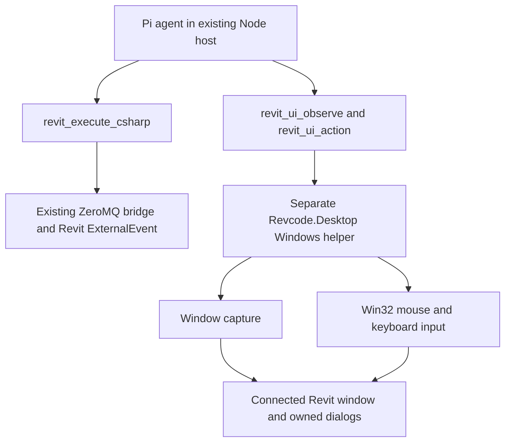

# Revit desktop interaction plan

Status: phase 1 standalone capture/input baseline implemented, 2026-09-13; see [helper protocol and usage](DESKTOP-PROTOCOL.md). The helper uses experimental visible-region GDI capture for comparison; HWND Windows.Graphics.Capture evaluation, live Revit acceptance, and phases 2–5 remain pending. No live automation or model-driven desktop reliability is claimed.

Review revision: use C# P/Invoke to `user32.dll` / `SendInput` for actual input. The remaining feasibility questions are capture coverage, reliable visual targeting, and delivery of images through the existing agent integration. Basic Stop, exclusive input ownership, and dispatch receipts must exist before enabling model-driven actions.

## Decision and evidence

Give Revcode visual observation and real mouse/keyboard control of the connected Revit session. Keep `revit_execute_csharp` for precise model operations and API verification. Use the desktop path for workflows the API cannot complete.

FlaUI/UI Automation is not part of this implementation. User-provided Revit 2026.3 inspection screenshots showed the File button with `Invoke: No` and a Project Browser pane with `Value: No`; they did not demonstrate actionable access to the search field. This is insufficient evidence for dependable semantic control coverage, although it does not prove all Revit controls are inaccessible. Further manual FlaUInspect investigation is not required. Do not substitute another UIA wrapper as the primary approach.

The agent will identify visible targets from images, act on screenshot-relative coordinates, and inspect the result. No DOM, automation IDs, OCR service, or provider-specific computer-use API is required. OCR or accessibility metadata can be reconsidered after the visual approach passes its own tests.

## Architecture



Bundle a self-contained Windows x64 C# helper, launched hidden by the existing per-Revit Node host. Communicate over inherited stdin/stdout with bounded, versioned JSON messages; reserve stderr for diagnostics. Bind it to the existing Revit PID plus process start identity, and validate window ownership. The agent receives opaque window references, not permission to select arbitrary processes. Exit the helper when its host or bound Revit process exits.

The helper does not load RevitAPI.dll. Capturing, waiting for dialogs, and input dispatch must remain independent of ExternalEvent. Preserve the native API bridge and its receipts.

## Observation and action contract

Proposed tools, subject to the capture/input spike:

```typescript
revit_ui_observe({ windowRef?: string, crop?: { x: number, y: number, width: number, height: number } })
revit_ui_action({
  observationId: string,
  action: "move" | "click" | "double_click" | "type" | "key" | "scroll",
  x?: number, y?: number,
  text?: string, key?: string, modifiers?: string[],
  button?: "left" | "right", delta?: number
})
```

Implement action-specific discriminated schemas rather than accepting invalid combinations of optional fields. `type` inserts literal text into the already-focused field; replacement uses explicit selection/key actions. A coordinate is never an element identity. Dragging and sustained key holds are deferred until basic actions pass validation.

`move` enables hover menus and tooltips without a click. Pointer actions, including scroll, require a target point in the supplied image. Specify scroll direction and wheel-notch units explicitly rather than an ambiguous pixel delta; map one notch to Windows `WHEEL_DELTA` (120). Key chords use a small named-key allowlist and always include releases. Bound text length and emit cancellable chunks; an action never accepts a script or arbitrary Win32 call.

Observation returns an actual image content block plus metadata: observation ID, timestamp, opaque window reference, title, image dimensions, physical capture bounds, crop/resize transform, DPI, foreground window, known owned dialogs, and `actionable`. Include active document context and its age when available; a title or stale API snapshot is not proof of document identity. Observation itself never activates a window or changes input focus. Passive observations, including busy/unknown recovery captures, return `actionable: false`; only images captured with valid workflow ownership, input lease, focus, and native state may authorize an action.

Use the chosen Pi model's verified image-input capability. The updated base already implements `revit_capture_view` with actual image tool results and an image-capability gate. Reuse that result mechanism for desktop images, extending the tool inventory assertion, agent instructions, browser evidence rendering, and transcript/artifact persistence. API view exports do not show the ribbon or dialogs and do not authorize desktop coordinates. Test that the provider actually receives the desktop image. Text-only models retain API operation and cannot autonomously choose visual click coordinates. Do not silently switch providers. Screenshots are supplied to the selected provider as model input; show this behavior in the UI and bound artifact size and retention.

The updated base checks model image capabilities inside the capture tool and lets custom provider models declare `supportsImages`. Its provider summary still omits input capabilities; extend that summary for desktop status and add an actual desktop image-input smoke test for the selected provider/model. Each prompt currently creates a new Pi session and reconstructs only plain-text conversation history. Persist bounded image artifacts and structured action evidence, then explicitly restore relevant evidence across turns (or require a fresh observation); never imply old image bytes survived via the text transcript. Image transport needs a MIME type, byte/pixel limits, and a specified encoding separate from ordinary action metadata.

Each action is tied to a recent observation. Map image coordinates through crop and scaling into physical desktop pixels, including negative multi-monitor origins. Revalidate process identity, window bounds, active dialog, foreground ownership, and the target point before input. Window movement, resize, focus changes, stale observations, or changed dialogs require a fresh observation. These checks reduce races; they cannot make desktop interaction atomic against human input.

The host's desktop-workflow start transition acquires the input lease and attempts focus acquisition once before requesting an actionable observation; this is separate from the read-only observe tool. If Windows refuses, show a paused state asking the user to activate Revit. A later focus change invalidates the observation instead of causing repeated focus stealing. Check the visible window at the target point as well as foreground ownership so an occluding window cannot receive the click. A fresh frame and valid geometry still cannot prove that a dynamic control has not changed; keep one semantic action per observation and verify the result.

Return dispatch status and a new screenshot. Successfully inserting input is not proof the workflow succeeded. The agent must check the visible result and use a Revit API query afterward when the result is represented in the model.

## Windows implementation spike

Evaluate Windows.Graphics.Capture for main-window and dialog images, including Revit's GPU viewport. For this desktop helper, use the HWND interop entry point `IGraphicsCaptureItemInterop.CreateForWindow` (Windows 10 1903+) and runtime support checks; a picker-based sample alone is not the integration. Enumerate owned top-level dialogs separately; do not assume a main-window image includes popups. Cross-process external dialogs are unsupported initially unless explicitly bound by a later design. If window capture misses menus or tooltips, evaluate a visible desktop-region capture with explicit occlusion handling. Select and document the capture backend from measured results, including its frame timestamps, resizing behavior, borders, and client/nonclient pixel origin. Reject missing or obsolete frames; a dark or unchanged image alone is not proof of a capture failure. Do not act on a hidden window merely because its captured image looks correct.

Use C# P/Invoke to `user32.dll` / `SendInput` for pointer events, Unicode text, and a bounded set of key chords. No FlaUI, AutoHotkey, Python, or separate automation application is required. Verify inserted-event counts; partial insertion is an uncertain action, not permission to resend the remainder. Release keys/buttons owned by the helper on stop or failure. Check existing modifier/button state before input and pause when human-held input could interfere. Unicode text uses `KEYEVENTF_UNICODE` (including UTF-16 surrogate handling); control keys use key events. Test non-ASCII text and the target Revit fields' handling of `VK_PACKET` rather than assuming every control supports it. Clipboard mutation is outside the initial typing path.

Declare `PerMonitorV2` DPI awareness in the helper manifest before any windows are created. Use absolute mouse movement with `MOUSEEVENTF_ABSOLUTE | MOUSEEVENTF_VIRTUALDESK`, transforming physical desktop coordinates into the normalized 0–65535 range; test edge pixels and mixed-DPI monitor arrangements. Run at the user's normal integrity level and compare target integrity separately: SendInput's error does not identify UIPI as the cause. Report mismatch rather than silently elevating. Require an unlocked interactive desktop; minimized/locked/disconnected sessions are unsupported for input in the first release.

Focus acquisition can fail. Verify it and pause instead of typing into another application. Detect human interference and yield control. A desktop-wide input lease shared by all Revcode hosts is required because separate Revit processes share the same mouse and keyboard; a per-Revit queue alone is insufficient. The browser needs a visible control status, latest screenshot, and Stop, with a desktop emergency-stop shortcut that does not depend on browser focus.

Hold a named, user/session-scoped mutex for the active workflow, including its model-thinking intervals, and release it on Stop, completion, or failure. Use a watchdog/host heartbeat and bounded inactivity timeout; recovery from an abandoned mutex requires fresh observation, never automatic action resumption. Register the emergency shortcut in the lease-owning helper's message loop with `RegisterHotKey`; if registration fails, do not enable unattended action mode. Stop must be handled independently of pending capture/model calls. Only short input batches may be queued because already inserted events cannot be recalled. Interference detection is best effort; test it and document remaining races rather than promising isolation from the user.

## API coordination, dialogs, and recovery

Keep one workflow owner per Revit process and serialize ordinary API edits with UI actions. Observation remains available while native execution is busy or has an unknown result.

Provide an independent read-only observation route and UI control: the existing chat/execute entry points reject busy or unknown native state, so a helper that can capture by itself is insufficient. A screenshot must not clear the native unknown-outcome fence, which currently requires restart. UI actions also remain blocked by that fence unless a later, explicit reconciliation protocol changes it. Unlike API calls that may target a non-active document, desktop actions operate on the active UI document. Bind a workflow to its intended document token where available, stop on unplanned document switches, and handle intended switches through an explicit transition followed by context revalidation when the API is available.

For supported commands, an API-mode snippet may post a command and return immediately; then observe for the actual UI transition. Posting does not prove command completion. Do not hold a wrapper transaction or wait for UI automation inside a C# snippet.

Deliver workflows started from idle Revit first. A subsequent gate adds dialogs raised during an ongoing API call: the scheduler must explicitly let the same workflow service that dialog without allowing unrelated mutations. The current host's blanket busy check and synchronous tool wait cannot support this unchanged. Implement a correlated dialog-wait state or bounded orchestration path, test it, and otherwise report that workflow unsupported. Do not bypass the existing unknown-outcome fence to click an arbitrary confirmation.

Persist action intent, request ID, target observation, and dispatch receipt. Duplicate IDs retrieve receipts and never replay input. If the helper or transport fails after possible dispatch, record an unknown outcome and inspect before any further mutation. Read-only screenshots must still work during reconciliation. Stop cancels future input and releases held input; it neither kills Revit nor undoes earlier UI/API effects. UI workflows have no whole-workflow rollback or single-Undo guarantee.

Use a helper generation and a per-generation dispatch ledger as well as the durable host journal. A restarted helper must reject prior-generation requests whose outcome cannot be recovered; do not claim exactly-once behavior across a crash between input dispatch and receipt persistence. Absence of a post-action screenshot is distinct from confirmed non-dispatch.

Use bounded observation retries for loading states. Pixel stability alone is not proof of completion. Unexpected dialogs, ambiguous targets, or unmet postconditions stop the action sequence with evidence rather than triggering blind repeated clicks. Treat text visible in screenshots as application data, not instructions to the agent.

## Delivery and acceptance gates

| Phase | Deliverable | Required evidence |
| --- | --- | --- |
| 1. Capture and input spike | Standalone helper attached to a disposable Revit session; no LLM required | Capture ribbon, Project Browser, viewport, hover menu, and dialog. Click search, type a unique string, verify its display, and clear it. Verify mapping at 100%, 150%, and 200% scaling and on a second monitor, including mixed DPI/negative origins and resized images. Test foreground refusal, occlusion, non-ASCII input, and local emergency Stop. Record backend and failures. |
| 2. Host tools and visual reasoning | Register two desktop tools, transmit images to Pi, render evidence; include input lease, cancellation, deduplication, and basic unknown-outcome handling | A vision-capable selected model locates and operates search from a fresh screenshot after window movement; a text-only model cannot issue visual actions. Verify image evidence across turns, competing hosts cannot dispatch, and Stop prevents further batches during model/capture waits. No hardcoded screen position is used as a persistent target. |
| 3. Complete UI workflow | One concrete API-limited workflow selected from the user's actual task, including a dialog | Agent opens the workflow, fills fields, completes it, and verifies the visible result plus API state where available. Record at least ten repetitions, all failures, action count, and latency. Search alone does not establish workflow feasibility. |
| 4. Interruption and recovery | Input lease, Stop, uncertain outcomes, dialog coordination | Test focus theft, unexpected dialog, process exit/restart, helper disconnect after click, duplicate request, stale image, locked desktop, and competing Revit hosts. Confirm no automatic replay or input to an unrelated app. Test API-raised dialogs separately before claiming support. |
| 5. Packaging and compatibility | Bundled helper, lifecycle cleanup, documentation | Installed package works without SDK/FlaUI/manual scripts; validate each supported Revit/runtime profile. Capture and report limitations for GPU modes, scaling, language, and monitor arrangements actually tested. |

The first milestone is the capture/input spike, followed by one complete user-relevant workflow. Do not promise general autonomous canvas modeling, reliable arbitrary dialogs, background desktop operation, or a delivery estimate until those gates provide evidence. Prefer the API for geometric precision even after UI input is available.

## Repository integration

- Add `dotnet/Revcode.Desktop/` for capture, window binding, input, and helper protocol.
- Add a desktop client and validated tool contracts under `src/host/`; extend its operation journal and scheduler in `server.ts`. `Operation` currently extends `ExecuteInput` and `Agent.prompt` accepts only a C# execution callback: introduce a discriminated operation union or separate desktop ledger and typed tool dispatcher, not fake C# fields. Route cancellation by operation kind; the current cancel endpoint forwards all nonterminal operations to native cancellation.
- Extend `src/host/pi-agent.ts` and agent types for the intended tool inventory and image results. Preserve the existing API tool contract.
- Extend `web/` for observation images, action evidence, control status, and Stop.
- Update `scripts/package.ps1`, `runtime.json`, package validation, and launcher/Node startup to resolve and launch the bundled helper. The current parent-PID argument is not a process-start identity; add verified binding and parent lifecycle handling. Select the helper's self-contained Windows runtime independently from the in-process Revit add-in runtime. Add meaningful coordinate-transform, request-deduplication, scheduling, and recovery tests plus live Revit acceptance cases in `docs/TESTING.md` when implemented.
- Document the helper protocol separately from the existing native Revit wire contract; version any changed native messages needed for dialog coordination.

## Sources and limits

- [Microsoft screen capture](https://learn.microsoft.com/en-us/windows/apps/develop/media-authoring-processing/screen-capture): window/display frame acquisition and support checks; actual Revit rendering coverage remains a spike result.
- [Microsoft SendInput](https://learn.microsoft.com/en-us/windows/win32/api/winuser/nf-winuser-sendinput): mouse/keyboard injection, return counts, existing keyboard state, and integrity-level restrictions.
- [Windows capture HWND interop](https://learn.microsoft.com/en-us/windows/win32/api/windows.graphics.capture.interop/nf-windows-graphics-capture-interop-igraphicscaptureiteminterop-createforwindow): capturing a bound window from a desktop application and the OS minimum.
- [Microsoft MOUSEINPUT](https://learn.microsoft.com/en-us/windows/win32/api/winuser/ns-winuser-mouseinput) and [KEYBDINPUT](https://learn.microsoft.com/en-us/windows/win32/api/winuser/ns-winuser-keybdinput): virtual-desktop absolute coordinates, wheel units, Unicode text, and control-key events.
- [Microsoft DPI awareness](https://learn.microsoft.com/en-us/windows/win32/hidpi/setting-the-default-dpi-awareness-for-a-process): manifest configuration and initialization timing.
- [Microsoft SetForegroundWindow](https://learn.microsoft.com/en-us/windows/win32/api/winuser/nf-winuser-setforegroundwindow) and [RegisterHotKey](https://learn.microsoft.com/en-us/windows/win32/api/winuser/nf-winuser-registerhotkey): foreground restrictions and desktop emergency-stop registration.
- [Microsoft UI Automation threading](https://learn.microsoft.com/en-us/windows/win32/winauto/uiauto-threading): risks of automating an application's own UI on its UI thread; supports process separation if accessibility is ever added later.
- [Autodesk PostCommand](https://help.autodesk.com/cloudhelp/2026/ENU/Revit-API-MainReference/files/html/b0df464d-1733-ea9e-ac40-399fa9c9a037.htm): queued command invocation after returning from the API context.
- [Desktop session limitations](https://pywinauto.readthedocs.io/en/latest/remote_execution.html): practical active-desktop and RDP constraints; this source does not imply a pywinauto dependency.

This design is an engineering proposal informed by documentation and the user's inspection screenshots. Real input, screenshots delivered to the model, and workflow completion must be demonstrated before claiming reliability.
